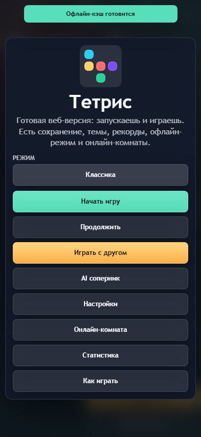
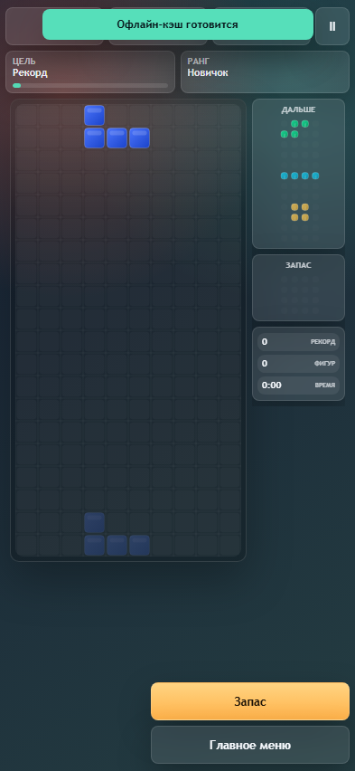

# BlockDrop Web Game

Browser Tetris-style game with multilingual UI, solo modes, AI practice, local saves, server records, and online PvP rooms.

Live demo: [http://45.148.117.119/](http://45.148.117.119/)

## Features

- 10x20 playfield with ghost piece, hold, next queue, 7-bag randomizer, SRS wall kicks, DAS/ARR, and lock delay.
- Classic, 40 Lines, Zen, and Chaos modes.
- Local stats, best score, autosave, achievements, and server leaderboard.
- Web Audio API sound effects for move, rotate, hard drop, line clear, Tetris, combo, level up, game over, and PvP attacks, with subtle theme variations.
- Online rooms with shareable `/room/CODE` links, garbage attacks, tournament timer, and opponent progress silhouette.
- AI opponent for offline practice when online PvP is inconvenient.
- Russian and English UI from the settings menu.
- Interactive beginner tutorial in the How to Play section.
- Mobile rendering optimization: canvas resize caching plus a battery performance mode.
- Offline-friendly assets plus PWA files for secure hosts.

Current mobile screenshots:




## Controls

- Keyboard: arrows or WASD to move, Up/W/X to rotate, Q to rotate back, Space/Z for hard drop, C/H/E/Shift for hold, P/Esc for pause.
- Mouse/trackpad on the board: click to rotate, double click to rotate back, drag left/right to move, drag down to drop, right click for hold.
- Touch: tap to rotate, double tap to rotate back, swipe left or right to move, swipe down for soft drop, fast swipe down for hard drop, long press for hold.
- Main menu includes quick access to Stats and How to Play.
- Settings include language, performance mode, swipe sensitivity, handedness, theme, soft vibration, and one volume slider.

## Installation

```bash
npm install
npm start
```

Open [http://localhost:8787](http://localhost:8787).

`index.html` still works for static solo play. Online rooms and server records require `server.js`.

For a static live demo on GitHub Pages:

1. Push the repository to GitHub.
2. Enable Pages from the `master` branch.
3. Open the generated Pages URL.

GitHub Pages cannot run `server.js`, so multiplayer and server records need a VPS or another Node host.

## Development

Project structure:

```text
index.html
styles.css
js/config.js
js/game-core.js
js/game.js
js/ui.js
js/input.js
js/audio.js
js/online.js
js/storage.js
server.js
tests/
e2e/
screenshots/
```

Refactor status:

- `js/game.js` now coordinates state, loop, and module orchestration.
- `js/ui.js` owns DOM rendering, overlays, HUD, and control bindings.
- `js/audio.js` owns sound setup and playback helpers.
- `js/online.js` owns WebSocket/PvP helpers and message handling utilities.
- `js/storage.js` owns local persistence helpers.
- `js/ui.js` also applies lightweight runtime translations for Russian and English.

Useful scripts:

```bash
npm start
npm run dev
npm run lint
npm test
npm run test:e2e
npm run format
```

## Testing

Run checks locally:

```bash
npm run lint
npm test
npm run test:e2e
```

Current automated coverage:

- Vitest: piece generation, 7-bag randomizer, collisions, SRS kicks, line clears, scoring, hold, game over, garbage and attack logic.
- Playwright: app loads, game starts, piece input works, pause works, game over overlay can be shown.
- Screenshot smoke checks are used before releases to refresh `screenshots/menu-mobile.png` and `screenshots/game-mobile.png`.

## Online

Example room URL:

- Local: [http://localhost:8787/room/DUEL](http://localhost:8787/room/DUEL)
- Public: [http://45.148.117.119/room/DUEL](http://45.148.117.119/room/DUEL)

Use **Play with friend / Играть с другом** from the main menu to generate a room URL automatically and share it.

Server notes:

- WebSocket messages are validated.
- Oversized and suspicious payloads are closed.
- Update and attack messages are rate-limited.
- The current system is room-safe, but not fully server-authoritative for competitive anti-cheat yet.

## Roadmap

- Split `js/game.js` further into smaller runtime modules such as scene, HUD state, coach logic, and PWA bootstrap.
- Expand Playwright coverage for mobile layouts and online flows.
- Add stricter server-side score authority for ranked rooms.
- Add richer tournament views, replay tools, and a deeper AI difficulty selector.
- Add more media such as a short gameplay GIF.

## Known Issues

- The public IP URL is plain HTTP, so full install/PWA behavior is limited by browser security rules.
- Competitive multiplayer still trusts some client-reported values; this is fine for casual rooms, but not ideal for ranked play.
- Playwright needs browser binaries available in the environment.
- Vite shows a deprecation warning for the CJS Node API in the current test config; tests still pass.
