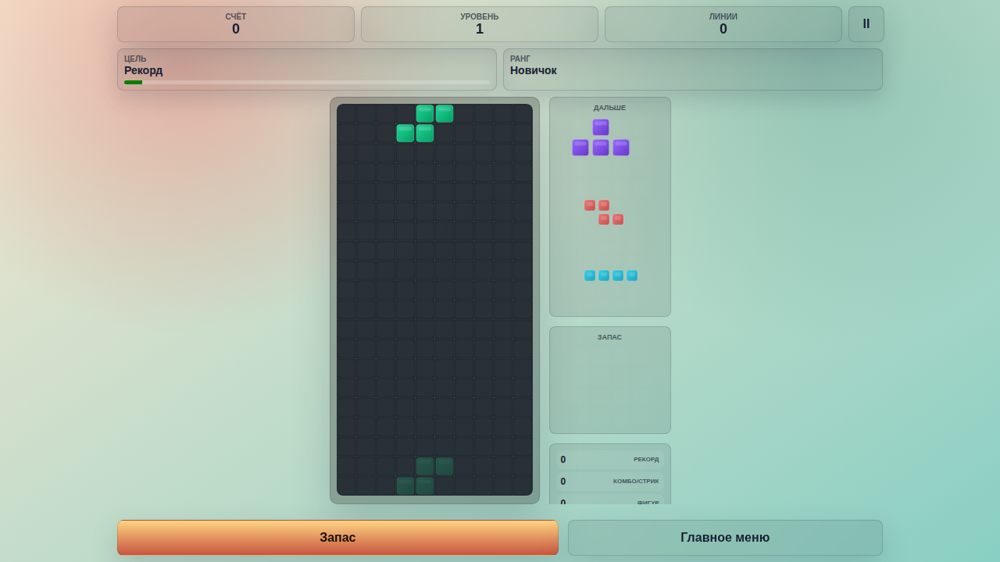

# BlockDrop

[](https://github.com/popka2007-root/blockdrop-web-game/actions/workflows/ci.yml)
[](https://github.com/popka2007-root/blockdrop-web-game/actions/workflows/build-apk.yml)
[](https://github.com/popka2007-root/blockdrop-web-game/releases/latest)
[](LICENSE)

Детерминированная falling-blocks игра для Web/PWA и Android: одиночные режимы, AI в Web Worker, проверяемые повторы и server-authoritative PvP на общем игровом движке.

_BlockDrop is a deterministic falling-blocks game with RU/EN UI, offline support, AI, verified replays and authoritative multiplayer._

[Играть](http://45.148.117.119/) · [Релиз 3.1.0](https://github.com/popka2007-root/blockdrop-web-game/releases/tag/v3.1.0) · [Production runbook](docs/operations.md) · [Баланс](docs/BALANCE.md)

> Публичный стенд пока работает по HTTP и может обновляться позже ветки `master`. До появления HTTPS аккаунты, ranked и публичная установка PWA намеренно отключены серверными capabilities.



## Возможности

- Единый детерминированный engine v4 для браузера, Web Worker, replay и Node.js-сервера.
- 7-bag, SRS, hold, ghost piece, фиксированный tick, gravity и lock delay.
- Combo, back-to-back, T-Spin, Perfect Clear, garbage queue и cancellation.
- Одиночная игра, Daily Challenge, локальный профиль, задания и косметические награды.
- Четыре уровня AI на beam search без блокировки основного UI-потока.
- Replay с seed, input stream, checkpoints, checksum, seek и скоростью 0.5×–4×.
- Casual PvP по WebSocket с authoritative snapshots, prediction, reconciliation и reconnect grace period.
- RU/EN, клавиатура и touch, screen-reader описание поля, focus management и reduced motion.
- Адаптивные профили для Galaxy S25 FE, небольших мобильных экранов и landscape.
- Offline fallback, безопасное обновление service worker и Android-сборка через Capacitor.
- SQLite WAL, forward-only migrations, проверяемые backup/restore, structured logs и Prometheus metrics.

## Быстрый старт

Требования:

- Node.js `>=22.13.0`;
- npm;
- Git.

```bash
git clone https://github.com/popka2007-root/blockdrop-web-game.git
cd blockdrop-web-game
npm ci
npm start
```

Откройте [http://localhost:8787](http://localhost:8787). Локальная SQLite-база создаётся автоматически и игнорируется Git.

Другой порт и отдельный путь к БД:

```bash
PORT=9000 BLOCKDROP_DB_FILE=/opt/blockdrop-data/blockdrop.sqlite npm start
```

PowerShell:

```powershell
$env:PORT = "9000"
$env:BLOCKDROP_DB_FILE = "C:\blockdrop-data\blockdrop.sqlite"
npm start
```

## Управление

| Действие               | Клавиши                   |
| ---------------------- | ------------------------- |
| Движение               | `←` / `→` или `A` / `D`   |
| Soft drop              | `↓` или `S`               |
| Hard drop              | `Space` или `Z`           |
| Поворот по часовой     | `↑`, `W` или `X`          |
| Поворот против часовой | `Q`                       |
| Hold                   | `C`, `H`, `E` или `Shift` |
| Пауза                  | `P` или `Esc`             |

На сенсорном экране доступны tap, double tap, swipe и long press. В настройках можно выбрать жесты, экранные кнопки или гибридный режим, ведущую руку и чувствительность.

## Архитектура

```text
Browser / PWA / Android WebView
  ├─ js/game.js                UI и orchestration сессии
  ├─ js/runtime-loop.js        фиксированный игровой цикл
  ├─ js/online-controller.js   PvP lifecycle и reconciliation
  ├─ js/ai-worker.js           AI вне main thread
  └─ js/replay.js              запись и воспроизведение
             │
             ▼
  shared/engine.js + shared/protocol.js
             │
             ▼
  server.js                   authoritative match loop
  ├─ server-http.js           HTTP/API/static/health
  ├─ server-store.js          SQLite и migrations
  ├─ server-auth.js           auth contracts
  ├─ server-transport.js      origin/proxy boundary
  └─ server-observability.js  logs и metrics
```

Движок и протокол находятся в `shared/`, поэтому одинаковые seed и inputs дают одинаковый snapshot/checksum в браузере, Worker и Node.js.

## Основные команды

| Команда                     | Назначение                                             |
| --------------------------- | ------------------------------------------------------ |
| `npm start`                 | Запустить HTTP/WebSocket сервер                        |
| `npm run build`             | Собрать web assets в `www/`                            |
| `npm run lint`              | Проверить исходники ESLint                             |
| `npm test`                  | Запустить unit, property, integration и contract tests |
| `npm run test:coverage`     | Запустить Vitest с coverage gates                      |
| `npm run test:e2e`          | Запустить Playwright functional и performance suites   |
| `npm run verify`            | Выполнить полный локальный release gate                |
| `npm run balance:calibrate` | Проверить AI, scoring, garbage и задания               |
| `npm run db:verify-backup`  | Проверить цикл SQLite backup/restore                   |
| `npm run feature:rollout`   | Изменить staged rollout feature flag                   |
| `npm run soak:100`          | Запустить двухчасовой soak на 100 CCU                  |

Перед первым E2E-прогоном установите браузеры:

```bash
npx playwright install chromium firefox webkit
npm run verify
```

## Android

Для локальной сборки нужны JDK 21 и Android SDK:

```bash
npm run build
npx cap sync android
cd android
./gradlew assembleDebug
```

На Windows используйте `gradlew.bat assembleDebug`. APK появится в `android/app/build/outputs/apk/debug/`; build-артефакты не хранятся в Git. GitHub Actions прикладывает APK к каждому релизу.

## Сервер и feature gates

Минимальная конфигурация:

| Переменная                  | Назначение                    | По умолчанию         |
| --------------------------- | ----------------------------- | -------------------- |
| `PORT`                      | HTTP/WebSocket порт           | `8787`               |
| `BLOCKDROP_DB_FILE`         | Путь к SQLite                 | `./blockdrop.sqlite` |
| `BLOCKDROP_ALLOWED_ORIGINS` | Разрешённые WebSocket origins | same-origin          |
| `BLOCKDROP_METRICS_TOKEN`   | Bearer token для `/metrics`   | только loopback      |
| `BLOCKDROP_TRUST_PROXY`     | Доверять reverse proxy        | `false`              |

Capabilities API — единственный источник доступности клиентских функций. На публичном HTTP `accounts`, `ranked` и `pwaInstall` остаются выключенными независимо от значений в БД.

Production deployment использует pinned SSH key, exact release tag, pre-migration backup, атомарный cutover и rollback. Полная инструкция находится в [docs/operations.md](docs/operations.md).

## Структура репозитория

| Путь         | Содержимое                                                       |
| ------------ | ---------------------------------------------------------------- |
| `js/`        | UI, input, modes, progression, replay, AI и online orchestration |
| `shared/`    | Детерминированные engine, AI, balance и protocol                 |
| `server*.js` | Серверные границы и authoritative match loop                     |
| `tests/`     | Vitest unit, property, integration, security и contracts         |
| `e2e/`       | Playwright mobile, accessibility, PWA, security и visual tests   |
| `scripts/`   | Build, backup/restore, release, rollout, calibration и soak      |
| `android/`   | Capacitor Android project и Gradle wrapper                       |
| `deploy/`    | systemd units, Prometheus alerts и Grafana dashboard             |
| `docs/`      | Баланс, design system и production runbook                       |

`node_modules/`, `coverage/`, `test-results/`, `www/`, локальные SQLite-файлы и Android build-каталоги являются регенерируемыми или локальными данными и игнорируются Git.

## Документация

- [Balance and calibration](docs/BALANCE.md)
- [Design system](docs/design-system.md)
- [Production operations](docs/operations.md)
- [Security policy](SECURITY.md)
- [Privacy notice](PRIVACY.md)
- [Beta terms](TERMS.md)

## Лицензия

[MIT](LICENSE) © BlockDrop contributors.
